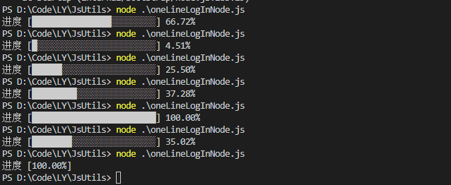

### Js轮子
- Js二分查找
- Js冒泡排序
- Js快排
- Js归并排序
- JsGenerator协程
- Js跨浏览器事件处理
- JsDate日期处理
- Node单行输出（百分比、进度条）

- Js判断UserAgent
- react移动端滚屏组件
- nodeCluster
- JSClearAllTimers 清除所有定时器
- JsDebounce 函数防抖(Simple 版本)
- JsThrottle 函数节流(时间戳版本 定时器版本)

### 参考
- [Generator函数的异步应用](http://es6.ruanyifeng.com/?search=import&x=0&y=0#docs/generator-async)
- [Python协程版本生产者消费者模型](https://www.liaoxuefeng.com/wiki/0014316089557264a6b348958f449949df42a6d3a2e542c000/001432090171191d05dae6e129940518d1d6cf6eeaaa969000)  
- [关于ES6 Generator is already running](https://oss.so/article/82)
- 《算法图解》
- [《Js高级程序设计》 第三版]()
- [single-line-log | npm](https://www.npmjs.com/package/single-line-log)
- [lodash](https://www.lodashjs.com/)
